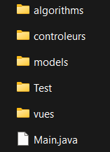
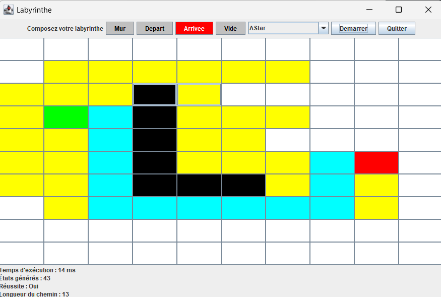
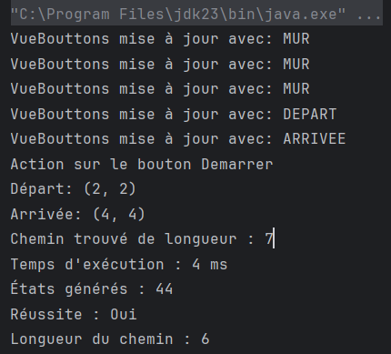

# R5.A.04 - Qualité Algorithmique : Algo 3 (BUT 3)

Januzi Rinor  
BUT 3 Informatique

---

## Table des matières

1. [Introduction](#introduction)
2. [Structure du projet](#structure-du-projet)
   - [Architecture MVC](#architecture-mvc)
   - [Structure des fichiers](#structure-des-fichiers)
3. [Modèle](#modèle)
4. [Vue](#vue)
5. [Contrôleur](#contrôleur)
6. [Algorithmes de recherche](#algorithmes-de-recherche)
   - [A*](#a*)
   - [Breadth-First Search (BFS)](#breadth-first-search-bfs)
   - [Depth-First Search (DFS)](#depth-first-search-dfs)
   - [Dijkstra](#dijkstra)
   - [Greedy Best-First Search](#greedy-best-first-search)
   - [IDA*](#ida*)
7. [Tests](#tests)
8. [Comparaison des algorithmes](#comparaison-des-algorithmes)
9. [Fonctionnalités clés](#fonctionnalités-clés)
10. [Installation et exécution](#installation-et-exécution)
11. [Exemples d'utilisation](#exemples-dutilisation)

## Introduction

Ce projet implémente un système de résolution de labyrinthes avec une interface graphique interactive. Il utilise plusieurs algorithmes de recherche de chemin et permet de visualiser leur fonctionnement en temps réel.

## Structure du projet

### Architecture MVC

Le projet suit une architecture Modèle-Vue-Contrôleur (MVC) :



### Structure des fichiers

Voici la structure des fichiers du projet :

```
C:.
│   .gitignore
│   README.md
│
├───src
│   │   Main.java
│   │
│   ├───algorithms
│   │       AlgorithmStats.java
│   │       AStar.java
│   │       BreadthFirstSearch.java
│   │       DepthFirstSearch.java
│   │       Dijkstra.java
│   │       GreedyBestFirstSearch.java
│   │       IDAStar.java
│   │       ManhattanHeuristic.java
│   │
│   ├───controleurs
│   │       EcouteurAlgo.java
│   │       EcouteurArrivee.java
│   │       EcouteurDemarrer.java
│   │       EcouteurDepart.java
│   │       EcouteurGrille.java
│   │       EcouteurMur.java
│   │       EcouteurQuitter.java
│   │       EcouteurVide.java
│   │
│   ├───models
│   │       Case.java
│   │       Labyrinthe.java
│   │
│   ├───Test
│   │       AStarTest.java
│   │       BreadthFirstSearchTest.java
│   │       DepthFirstSearchTest.java
│   │       DijkstraTest.java
│   │       GreedyBestFirstSearchTest.java
│   │       IDAStarTest.java
│   │
│   └───vues
│           VueAffichage.java
│           VueBouttons.java
│           VueFenetre.java
│           VueGrille.java
```

## Modèle

### Classe `Labyrinthe`

Représente la structure du labyrinthe :

```java
public class Labyrinthe extends Observable {
    private Case[][] grille;
    private Case depart;
    private Case arrivee;

    // ...
}
```

### Classe `Case`

Représente une cellule du labyrinthe :

```java
public class Case {
    public enum Statut { MUR, DEPART, ARRIVEE, VIDE }
    private int x, y;
    private Statut statut;
    private int cost;

    // ...
}
```

## Vue

### `VueFenetre`

Crée et configure la fenêtre principale :

```java
public class VueFenetre {
    private JFrame frame;
    private Labyrinthe labyrinthe;

    public VueFenetre() {
        // Initialisation de l'interface...
    }
}
```

### `VueGrille`

Affiche le labyrinthe sous forme de grille de boutons :

```java
public class VueGrille extends JPanel implements Observer {
    private JButton[][] buttons;

    // ...

    public void updateButtonColor(JButton button, Color color) {
        if (button.getBackground() != Color.GREEN && button.getBackground() != Color.RED) {
            button.setBackground(color);
        }
    }
}
```

## Contrôleur

Plusieurs classes d'écouteurs gèrent les interactions, par exemple :

```java
public class EcouteurDemarrer implements ActionListener {
    // ...
    @Override
    public void actionPerformed(ActionEvent e) {
        // Logique de démarrage de l'algorithme...
    }
}
```

## Algorithmes de recherche

Le projet implémente plusieurs algorithmes, dont :

### A*

```java
public Map<String, Object> search(Labyrinthe labyrinthe, Case start, Case goal) {
    PriorityQueue<Case> frontier = new PriorityQueue<>(Comparator.comparingInt(c -> 
        costSoFar.get(c) + ManhattanHeuristic.calculate(c, goal)));
    Map<Case, Case> cameFrom = new HashMap<>();
    Map<Case, Integer> costSoFar = new HashMap<>();

    frontier.add(start);
    cameFrom.put(start, null);
    costSoFar.put(start, 0);

    while (!frontier.isEmpty()) {
        Case current = frontier.poll();
        allVisited.add(current);
        stats.incrementStatesGenerated();
        updateUI(current, false);

        if (current.equals(goal)) {
            break;
        }

        for (Case next : getNeighbors(current, labyrinthe)) {
            int newCost = costSoFar.get(current) + 1;
            if (!costSoFar.containsKey(next) || newCost < costSoFar.get(next)) {
                costSoFar.put(next, newCost);
                frontier.add(next);
                cameFrom.put(next, current);
            }
        }
    }

    List<Case> shortestPath = reconstructPath(cameFrom, start, goal);
    long endTime = System.currentTimeMillis();

    stats.setExecutionTime(endTime - startTime);
    stats.setSuccess(shortestPath != null);
    stats.setPathLength(shortestPath != null ? shortestPath.size() - 1 : 0);

    if (shortestPath != null) {
        for (Case c : shortestPath) {
            updateUI(c, true);
        }
    }

    Map<String, Object> result = new HashMap<>();
    result.put("shortestPath", shortestPath);
    result.put("allVisited", allVisited);
    result.put("stats", stats);
    return result;
}
```

### Breadth-First Search (BFS)

```java
public Map<String, Object> search(Labyrinthe labyrinthe, Case start, Case goal) {
    Queue<Case> frontier = new LinkedList<>();
    Map<Case, Case> cameFrom = new HashMap<>();
    Set<Case> allVisited = new HashSet<>();

    frontier.add(start);
    cameFrom.put(start, null);
    allVisited.add(start);

    while (!frontier.isEmpty()) {
        Case current = frontier.poll();
        stats.incrementStatesGenerated();
        updateUI(current, false);

        if (current.equals(goal)) {
            break;
        }

        for (Case next : getNeighbors(current, labyrinthe)) {
            if (!allVisited.contains(next)) {
                frontier.add(next);
                cameFrom.put(next, current);
                allVisited.add(next);
            }
        }
    }

    List<Case> shortestPath = reconstructPath(cameFrom, start, goal);
    long endTime = System.currentTimeMillis();

    stats.setExecutionTime(endTime - startTime);
    stats.setSuccess(shortestPath != null);
    stats.setPathLength(shortestPath != null ? shortestPath.size() - 1 : 0);

    if (shortestPath != null) {
        shortestPath.forEach(c -> updateUI(c, true));
    }

    return Map.of(
            "shortestPath", shortestPath,
            "allVisited", new ArrayList<>(allVisited),
            "stats", stats
    );
}
```

### Depth-First Search (DFS)

```java
public Map<String, Object> search(Labyrinthe labyrinthe, Case start, Case goal) {
    Stack<Case> frontier = new Stack<>();
    Map<Case, Case> cameFrom = new HashMap<>();
    List<Case> allVisited = new ArrayList<>();

    frontier.push(start);
    cameFrom.put(start, null);

    while (!frontier.isEmpty()) {
        Case current = frontier.pop();
        allVisited.add(current);
        updateUI(current, false);
        stats.incrementStatesGenerated();

        if (current.equals(goal)) {
            break;
        }

        for (Case next : getNeighbors(current, labyrinthe)) {
            if (!cameFrom.containsKey(next)) {
                frontier.push(next);
                cameFrom.put(next, current);
            }
        }
    }

    List<Case> shortestPath = reconstructPath(cameFrom, start, goal);
    long endTime = System.currentTimeMillis();

    stats.setExecutionTime(endTime - startTime);
    stats.setSuccess(shortestPath != null);
    stats.setPathLength(shortestPath != null ? shortestPath.size() - 1 : 0);

    if (shortestPath != null) {
        shortestPath.forEach(c -> updateUI(c, true));
    }

    return Map.of(
            "shortestPath", shortestPath,
            "allVisited", allVisited,
            "stats", stats
    );
}
```

### Dijkstra

```java
public Map<String, Object> search(Labyrinthe labyrinthe, Case start, Case goal) {
    PriorityQueue<Case> frontier = new PriorityQueue<>(Comparator.comparingInt(Case::getCost));
    Map<Case, Case> cameFrom = new HashMap<>();
    Map<Case, Integer> costSoFar = new HashMap<>();

    frontier.add(start);
    cameFrom.put(start, null);
    costSoFar.put(start, 0);

    while (!frontier.isEmpty()) {
        Case current = frontier.poll();
        allVisited.add(current);
        updateUI(current, false);
        stats.incrementStatesGenerated();

        if (current.equals(goal)) {
            break;
        }

        for (Case next : getNeighbors(current, labyrinthe)) {
            int newCost = costSoFar.get(current) + 1;
            if (!costSoFar.containsKey(next) || newCost < costSoFar.get(next)) {
                costSoFar.put(next, newCost);
                next.setCost(newCost);
                frontier.add(next);
                cameFrom.put(next, current);
            }
        }
    }

    List<Case> shortestPath = reconstructPath(cameFrom, start, goal);
    long endTime = System.currentTimeMillis();

    stats.setExecutionTime(endTime - startTime);
    stats.setSuccess(shortestPath != null);
    stats.setPathLength(shortestPath != null ? shortestPath.size() - 1 : 0);

    if (shortestPath != null) {
        shortestPath.forEach(c -> updateUI(c, true));
    }

    return Map.of(
            "shortestPath", shortestPath,
            "allVisited", allVisited,
            "stats", stats
    );
}
```

### Greedy Best-First Search (GBFS)

```java
public Map<String, Object> search(Labyrinthe labyrinthe, Case start, Case goal) {
    PriorityQueue<Case> frontier = new PriorityQueue<>(Comparator.comparingInt(c -> ManhattanHeuristic.calculate(c, goal)));
    Map<Case, Case> cameFrom = new HashMap<>();

    frontier.add(start);
    cameFrom.put(start, null);

    while (!frontier.isEmpty()) {
        Case current = frontier.poll();
        allVisited.add(current);
        updateUI(current, false);
        stats.incrementStatesGenerated();

        if (current.equals(goal)) {
            bestPath = reconstructPath(cameFrom, start, goal);
            break;
        }

        for (Case next : getNeighbors(current, labyrinthe)) {
            if (!cameFrom.containsKey(next)) {
                frontier.add(next);
                cameFrom.put(next, current);
            }
        }
    }

    long endTime = System.currentTimeMillis();
    stats.setExecutionTime(endTime - startTime);
    stats.setSuccess(bestPath != null);
    stats.setPathLength(bestPath != null ? bestPath.size() - 1 : 0);

    if (bestPath != null) {
        bestPath.forEach(c -> updateUI(c, true));
    }

    return Map.of(
            "shortestPath", bestPath,
            "allVisited", allVisited,
            "stats", stats
    );
}
```

### IDA*

```java
public Map<String, Object> search(Labyrinthe labyrinthe, Case start, Case goal) {
    int threshold = ManhattanHeuristic.calculate(start, goal);

    while (true) {
        SearchResult result = search(start, 0, threshold, goal, labyrinthe, new HashSet<>(), allVisited);
        if (result.found) {
            bestPath = result.path;
            break;
        }
        if (result.cost == Integer.MAX_VALUE) {
            break;
        }
        threshold = result.cost;
    }

    long endTime = System.currentTimeMillis();
    stats.setExecutionTime(endTime - startTime);
    stats.setSuccess(bestPath != null);
    stats.setPathLength(bestPath != null ? bestPath.size() - 1 : 0);

    if (bestPath != null) {
        bestPath.forEach(c -> updateUI(c, true, allVisited));
    }

    return Map.of(
            "shortestPath", bestPath,
            "allVisited", allVisited,
            "stats", stats
    );
}
```

## Tests

Des tests unitaires ont été écrits pour vérifier le bon fonctionnement des algorithmes et de l'interface utilisateur. Les tests peuvent être exécutés avec JUnit.

### Explications des tests

Chaque algorithme de recherche a été testé pour s'assurer qu'il fonctionne correctement dans différents scénarios. Voici les détails des tests effectués :

#### Tests pour A*

```java
class AStarTest {
    private AStar aStar;
    private Labyrinthe labyrinthe;
    private VueGrille vueGrille;

    @BeforeEach
    void setUp() {
        labyrinthe = new Labyrinthe(5, 5);
        vueGrille = new VueGrille(5, 5, labyrinthe);
        aStar = new AStar(vueGrille);
    }

    @Test
    void testPathFound() {
        Case start = labyrinthe.getCase(0, 0);
        Case goal = labyrinthe.getCase(4, 4);
        Map<String, Object> result = aStar.search(labyrinthe, start, goal);
        // ...
    }

    @Test
    void testStartEqualsGoal() {
        Case start = labyrinthe.getCase(0, 0);
        Map<String, Object> result = aStar.search(labyrinthe, start, start);
        // ...
    }

    @Test
    void testNullStartOrGoal() {
        Case start = labyrinthe.getCase(0, 0);
        assertThrows(IllegalArgumentException.class, () -> {
            aStar.search(labyrinthe, null, start);
        });
        assertThrows(IllegalArgumentException.class, () -> {
            aStar.search(labyrinthe, start, null);
        });
    }
}
```

#### Tests pour Breadth-First Search (BFS)

```java
class BreadthFirstSearchTest {
    private BreadthFirstSearch bfs;
    private Labyrinthe labyrinthe;
    private VueGrille vueGrille;

    @BeforeEach
    void setUp() {
        labyrinthe = new Labyrinthe(5, 5);
        vueGrille = new VueGrille(5, 5, labyrinthe);
        bfs = new BreadthFirstSearch(vueGrille);
    }

    @Test
    void testPathFound() {
        Case start = labyrinthe.getCase(0, 0);
        Case goal = labyrinthe.getCase(4, 4);
        Map<String, Object> result = bfs.search(labyrinthe, start, goal);
        // ...
    }

    @Test
    void testStartEqualsGoal() {
        Case start = labyrinthe.getCase(0, 0);
        Map<String, Object> result = bfs.search(labyrinthe, start, start);
        // ...
    }

    @Test
    void testNullStartOrGoal() {
        Case start = labyrinthe.getCase(0, 0);
        assertThrows(IllegalArgumentException.class, () -> {
            bfs.search(labyrinthe, null, start);
        });
        assertThrows(IllegalArgumentException.class, () -> {
            bfs.search(labyrinthe, start, null);
        });
    }
}
```

#### Tests pour Depth-First Search (DFS)

```java
class DepthFirstSearchTest {
    private DepthFirstSearch dfs;
    private Labyrinthe labyrinthe;
    private VueGrille vueGrille;

    @BeforeEach
    void setUp() {
        labyrinthe = new Labyrinthe(5, 5);
        vueGrille = new VueGrille(5, 5, labyrinthe);
        dfs = new DepthFirstSearch(vueGrille);
    }

    @Test
    void testPathFound() {
        Case start = labyrinthe.getCase(0, 0);
        Case goal = labyrinthe.getCase(4, 4);
        Map<String, Object> result = dfs.search(labyrinthe, start, goal);
        // ...
    }

    @Test
    void testStartEqualsGoal() {
        Case start = labyrinthe.getCase(0, 0);
        Map<String, Object> result = dfs.search(labyrinthe, start, start);
        // ...
    }

    @Test
    void testNullStartOrGoal() {
        Case start = labyrinthe.getCase(0, 0);
        assertThrows(IllegalArgumentException.class, () -> {
            dfs.search(labyrinthe, null, start);
        });
        assertThrows(IllegalArgumentException.class, () -> {
            dfs.search(labyrinthe, start, null);
        });
    }
}
```
### Tests pour Dijkstra

```java
class DijkstraTest {

    private Dijkstra dijkstra;
    private Labyrinthe labyrinthe;
    private VueGrille vueGrille;

    @BeforeEach
    void setUp() {
        labyrinthe = new Labyrinthe(5, 5);
        vueGrille = new VueGrille(5, 5, labyrinthe);
        dijkstra = new Dijkstra(vueGrille);
    }

    @Test
    void testPathFound() {
        Case start = labyrinthe.getCase(0, 0);
        Case goal = labyrinthe.getCase(4, 4);
        Map<String, Object> result = dijkstra.search(labyrinthe, start, goal);
        // ...
    }

    @Test
    void testStartEqualsGoal() {
        Case start = labyrinthe.getCase(0, 0);
        Map<String, Object> result = dijkstra.search(labyrinthe, start, start);
        // ...
    }

    @Test
    void testNullStartOrGoal() {
        Case start = labyrinthe.getCase(0, 0);
        assertThrows(IllegalArgumentException.class, () -> {
            dijkstra.search(labyrinthe, null, start);
        });
        assertThrows(IllegalArgumentException.class, () -> {
            dijkstra.search(labyrinthe, start, null);
        });
    }
}
```

**Explications :**
- `testPathFound()`: Vérifie que l'algorithme trouve un chemin valide entre deux points distincts.
- `testStartEqualsGoal()`: Vérifie que l'algorithme gère correctement le cas où le point de départ est le même que le point d'arrivée.
- `testNullStartOrGoal()`: Vérifie que l'algorithme lance une exception appropriée lorsque le point de départ ou le point d'arrivée est nul.

### Tests pour Greedy Best-First Search (GBFS)

```java
class GreedyBestFirstSearchTest {

    private GreedyBestFirstSearch gbfs;
    private Labyrinthe labyrinthe;
    private VueGrille vueGrille;

    @BeforeEach
    void setUp() {
        labyrinthe = new Labyrinthe(5, 5);
        vueGrille = new VueGrille(5, 5, labyrinthe);
        gbfs = new GreedyBestFirstSearch(vueGrille);
    }

    @Test
    void testPathFound() {
        Case start = labyrinthe.getCase(0, 0);
        Case goal = labyrinthe.getCase(4, 4);
        Map<String, Object> result = gbfs.search(labyrinthe, start, goal);
        // ...
    }

    @Test
    void testStartEqualsGoal() {
        Case start = labyrinthe.getCase(0, 0);
        Map<String, Object> result = gbfs.search(labyrinthe, start, start);
        // ...
    }

    @Test
    void testNullStartOrGoal() {
        Case start = labyrinthe.getCase(0, 0);
        assertThrows(IllegalArgumentException.class, () -> {
            gbfs.search(labyrinthe, null, start);
        });
        assertThrows(IllegalArgumentException.class, () -> {
            gbfs.search(labyrinthe, start, null);
        });
    }
}
```

**Explications :**
- `testPathFound()`: Vérifie que l'algorithme trouve un chemin valide entre deux points distincts.
- `testStartEqualsGoal()`: Vérifie que l'algorithme gère correctement le cas où le point de départ est le même que le point d'arrivée.
- `testNullStartOrGoal()`: Vérifie que l'algorithme lance une exception appropriée lorsque le point de départ ou le point d'arrivée est nul.

### Tests pour IDA*

```java
class IDAStarTest {

    private IDAStar idaStar;
    private Labyrinthe labyrinthe;
    private VueGrille vueGrille;

    @BeforeEach
    void setUp() {
        this.labyrinthe = new Labyrinthe(5, 5);
        this.vueGrille = new VueGrille(5, 5, this.labyrinthe);
        this.idaStar = new IDAStar(this.vueGrille);
    }

    @Test
    void testPathFound() {
        Case start = labyrinthe.getCase(0, 0);
        Case goal = labyrinthe.getCase(4, 4);
        Map<String, Object> result = idaStar.search(labyrinthe, start, goal);
        // ...
    }

    @Test
    void testStartEqualsGoal() {
        Case start = labyrinthe.getCase(0, 0);
        Map<String, Object> result = idaStar.search(labyrinthe, start, start);
        // ...
    }

    @Test
    void testNullStartOrGoal() {
        Case start = labyrinthe.getCase(0, 0);
        assertThrows(IllegalArgumentException.class, () -> {
            idaStar.search(labyrinthe, null, start);
        });
        assertThrows(IllegalArgumentException.class, () -> {
            idaStar.search(labyrinthe, start, null);
        });
    }
}
```

**Explications :**
- `testPathFound()`: Vérifie que l'algorithme trouve un chemin valide entre deux points distincts.
- `testStartEqualsGoal()`: Vérifie que l'algorithme gère correctement le cas où le point de départ est le même que le point d'arrivée.
- `testNullStartOrGoal()`: Vérifie que l'algorithme lance une exception appropriée lorsque le point de départ ou le point d'arrivée est nul.

### Comparaison des algorithmes

| **Algorithme**  | **Complexité** | **Cas d'utilisation**                        |
|-----------------|----------------|----------------------------------------------|
| **A***          | \( O(b^d) \)   | Recherche informée efficace                  |
| **BFS**         | \( O(b^d) \)   | Chemin le plus court en nombre d'étapes      |
| **DFS**         | \( O(b^m) \)   | Exploration en profondeur, économe en mémoire |
| **Dijkstra**    | \( O(V^2) \)   | Chemin le plus court avec poids              |
| **Greedy BFS**  | \( O(b^m) \)   | Rapide mais peut manquer le chemin optimal   |
| **IDA***        | \( O(b^d) \)   | Comme A*, mais avec moins de mémoire        |

## Fonctionnalités clés

1. **Création interactive du labyrinthe** : L'utilisateur peut placer des murs, définir le départ et l'arrivée.
2. **Sélection d'algorithme** : Choix parmi plusieurs algorithmes via une liste déroulante.
3. **Visualisation en temps réel** : L'exploration du labyrinthe est visible à chaque étape.

### Capture d'écran


## Installation et exécution

1. Clonez le dépôt :
   ```bash
   git clone https://github.com/JRinor/Labyrinthe.git
   cd Labyrinthe
   ```

2. Compilez et exécutez le projet :
   ```bash
   javac -d bin src/**g/*.java
   java -cp bin Main
   ```

## Exemples d'utilisation

### Création d'un labyrinthe

1. Cliquez sur les boutons pour placer des murs, définir le départ et l'arrivée.
2. Sélectionnez un algorithme dans la liste déroulante.
3. Cliquez sur "Démarrer" pour lancer l'algorithme et visualiser le chemin trouvé.

### Exemple d'utilisation avec l'algorithme A*




